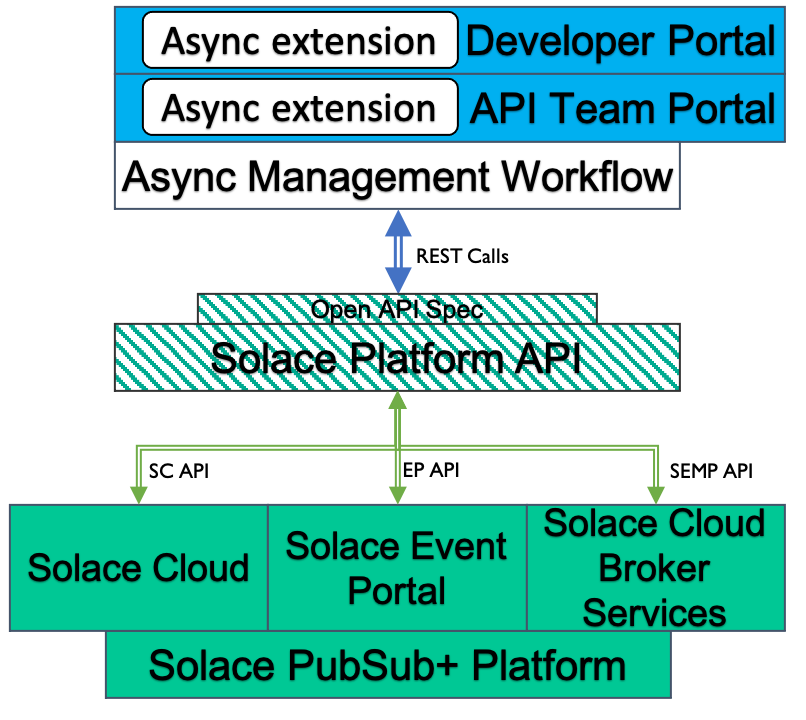

# Concepts

## The Solace Platform API

[See Solace Platform API on Github.](https://github.com/solace-iot-team/platform-api)

## High-Level Async Management Workflows

### API Exposure

### API Consumption

---
