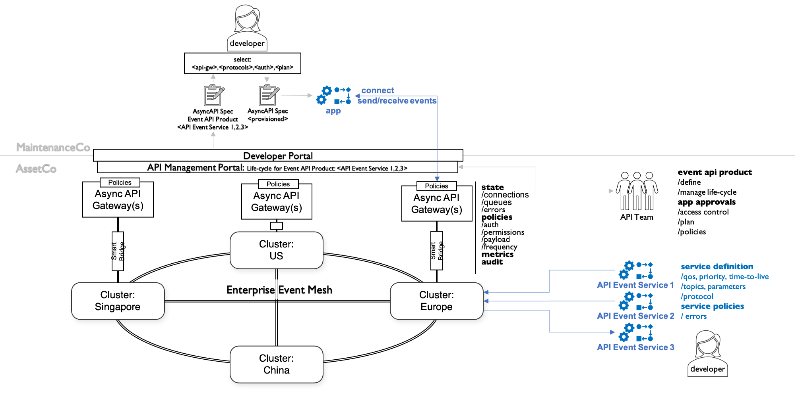
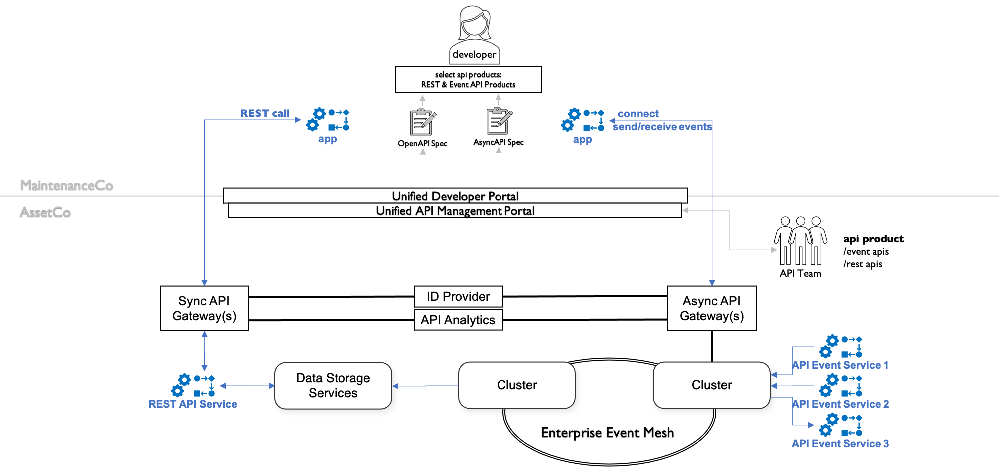

# Considerations for Unifying Synchronous & Asynchronous API Management

Author: Ricardo Gomez-Ulmke | June 2021

## Introduction

- the problem, the ask
- the goal
- what is explained here
- what isn't

### Example Use Cases for Our Discussion

In order to ascertain what mix of APIs we want to offer to our internal and external developers, we need to baseline our understanding of where Evented APIs apply vs. RESTful APIs.

Which in turn requires us to understand events themselves. A good overview, general discussion and best practices about Event-Driven Architectures (EDA) is offer in [[3]](#[3]).

#### Connected Assets

* **Maintenance**
  - elevator co
  - scenario: alarm or fault
    - alarm or fault raised, every event is important and must be acted upon
    - triggers workflow: immediate action, schedule maintenance, do maintenance
      - each step reports status back
* **Vehicle**
  - car-co
  - scenario: safety alarms, failure alarms
    - every event is important and must be acted upon
    - trigger different workflows:
      - start with AI to ascertain if immediate danger or not
      - safety:
        - driver has some time but should act in certain timeframe
        - garage should be notified
      - failure:
        - car not functioning
        - driver needs assistance as quickly as possible
        - need to know where car is:
          - on the road? notify recovery service, then garage
          - at home? notify garage
        - need to know if driver ok?
          - start dialog with driver
  - consumption:
    - get regular aggregate consumption data for analysis
    - observe stream of events -> trigger action when certain levels below threshold

#### Order Capture & Management

* **E-Commerce**
  - order submitted
    - instant feedback if submission ok
  - status updates for order
    - come when they come
    - never lose a message

#### Flight Status

* tricky / complicated
* api provider:
  - potentially high volume of status updates for all flights
* api consumer:
  - only interested in a sub-set of flights

- time-value of a status update: example: change of departure time
  - depends on current state of flight:
    - 3 weeks before departure:
      - a minor change in departure time needs action within a few days
      - a major change in departure time: should be acted upon quickly
    - 2 hours before flight:
      - change in departure time: immediate action required
    - after take off:
      - no value at all to passenger
      - has value for pickup on the other side

## Sync or Async API?

based on the use case discussion above, we realize that it is important to understand:
- for each event:
  - API Provider
    - understand volumes of incoming events, filtering & routing of outgoing events
    - urgency or time value of event, this might depend on situation
    - criticality of event: deliver at-least-once or at-most-once
  - API Consumer
    - understand what the consumer needs to do with an event
      - and provide the data and channels to support their needs

* candidates for Async
  - real-time notifications, high or very low volume
    - no need for polling, called when event happens that interests a sub-group of consumers
    - any event that happens - but we don't know when it might happen or if at all - and requires instant action when it happens
  - examples:
    - alarms, faults, exceptions, call-to-action like a purchase approval

* candidates for Sync
  - off-line analysis: get aggregated data
  - transactional: send order, get immediate response that receipt was ok

## Concepts

### AsyncAPI Management in Isolation

<i>Figure 1 - Async API Management</i>

### Unified API Management

<i>Figure 2 - Unified Sync & Async API Management</i>

### Details

## Conclusion

---
### References & Further Reading

[1] Ryan Grondal - [Why resources companies are looking to evented APIs](https://blogs.mulesoft.com/digital-transformation/business/resources-companies-evented-apis/)

[2] Dakshitha Ratnayake - [Event-driven APIs in Microservice Architectures](https://github.com/wso2/reference-architecture/blob/master/event-driven-api-architecture.md)

<a name="[3]"/>[3] Forrester - Event-Driven Architecture And Design: Five Big Mistakes And Five Best Practices, November 10, 2020

TODO:
- event mesh
- eda

---
